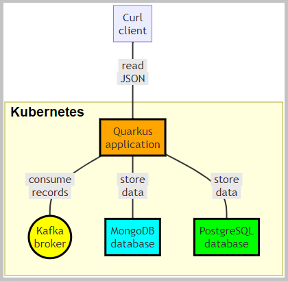
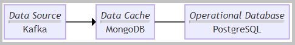
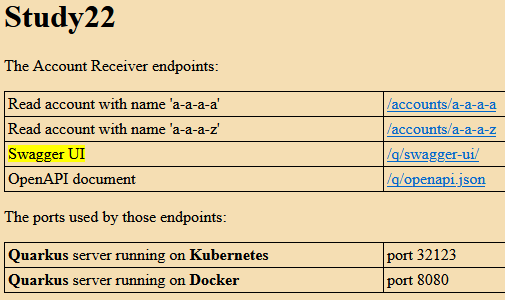
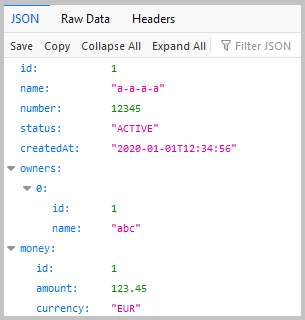
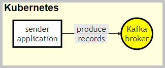
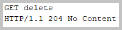

<!DOCTYPE html>
<HTML>
<HEAD>
	<META charset="UTF-8">
</HEAD>
<BODY>

<H2 id="contents">Study22 README Contents</H2>

Topics: Kubernetes ● Docker ● Quarkus ● Kafka ● MongoDB ● PostgreSQL

<H3>Research the Kubernetes and the Quarkus</H3>

The Account Receiver is implemented as a Quarkus application with Kafka consumer and JSON REST service.

Big list with Kafka records is fast consumed and stored in the document database MongoDB.  
 

<I>The data caching strategy implemented in the Account Receiver.</I>

The sections of this project:
<OL>
<LI><a href="#ONE"><b>Docker and Kubernetes Build</b></a></LI>
<LI><a href="#TWO"><b>Account Receiver</b></a></LI>
<LI><a href="#THREE"><b>Account Sender</b></a></LI>
<LI><a href="#FOUR"><b>Curl Client</b></a></LI>
</OL>

Java source code. Packages: 
 

    <i>project 'Study22-account-receiver', application sources</i>&nbsp;:&nbsp;
	<a href="https://github.com/k1729p/Study22/tree/main/account-receiver/src/main/java/kp">kp</a> 

    <i>project 'Study22-account-receiver', test sources</i>&nbsp;:&nbsp;
	<a href="https://github.com/k1729p/Study22/tree/main/account-receiver/src/test/java/kp">kp</a> 

    <i>project 'Study22-account-sender', application sources</i>&nbsp;:&nbsp;
	<a href="https://github.com/k1729p/Study22/tree/main/account-sender/src/main/java/kp/sender">kp.sender</a> 

 

    <i>project 'Study22'</i>&nbsp;:&nbsp;
    <a href="http://htmlpreview.github.io/?https://github.com/k1729p/Study22/blob/main/docs/apidocs/index.html">
	Java API Documentation</a>&nbsp;●&nbsp;
    <a href="http://htmlpreview.github.io/?https://github.com/k1729p/Study22/blob/main/docs/testapidocs/index.html">
	Java Test API Documentation</a> 

<H3 id="ONE">❶ Docker and Kubernetes Build</H3>

Action: 
 
 1. With batch file
<a href="https://github.com/k1729p/Study22/blob/main/0_batch/01%20Docker%20run%20Kafka%20MongoDB%20PostgreSQL.bat">
<I>"01 Docker run Kafka MongoDB PostgreSQL.bat"</I></a> create and run 
Docker containers 'kp-kafka', 'kp-mongodb', 'kp-postgresql'. 
 2. With batch file
<a href="https://github.com/k1729p/Study22/blob/main/0_batch/02%20Docker%20build%20sender%20and%20start.bat">
<I>"02 Docker build sender and start.bat"</I></a> build the Docker image 
 for the Account Sender application and 
start the Docker container 'study22-acc-sender'. 
 3. With batch file
<a href="https://github.com/k1729p/Study22/blob/main/0_batch/03%20Docker%20build%20receiver%20and%20start%20Quarkus.bat">
<I>"03 Docker build receiver and start Quarkus.bat"</I></a> build the Docker image 
 for the Account Receiver application and 
start the Docker container 'study22-acc-receiver'. 
It compiles the Account Receiver application 
to a native executable and packages this in a container. 
 4. With batch file
<a href="https://github.com/k1729p/Study22/blob/main/0_batch/04%20Kubernetes%20build.bat">
<I>"04 Kubernetes build.bat"</I></a> create kind cluster, install Kafka, MongoDB, and PostgreSQL, and 
load Docker images 
for the applications: Account Sender and Account Receiver. 
 5. With batch file
<a href="https://github.com/k1729p/Study22/blob/main/0_batch/05%20show%20Kubernetes%20logs.bat">
<I>"05 show Kubernetes logs.bat"</I></a> show a Kubernetes logs tail for 
Kafka, MongoDB, PostgreSQL, Account Sender, and Account Receiver. 

1.1. The Docker configuration files are in directory 
<a href="https://github.com/k1729p/Study22/tree/main/docker-config">docker-config</a>.

1.2. The Kubernetes configuration files are in directory 
<a href="https://github.com/k1729p/Study22/tree/main/kubernetes-config">kubernetes-config</a>.

1.3. The <a href="images/ScreenshotDockerContainers.png">screenshot</a> of the created Docker containers.

1.4. The information about the Kubernetes extracted from the console log 
of the batch file <a href="https://github.com/k1729p/Study22/blob/main/0_batch/04%20Kubernetes%20build.bat"><I>"04 Kubernetes build.bat"</I></a> 
(Helm charts, Docker images, Kubernetes cluster info, namespaces, services, persistent volumes, deployments, 
kind-control-plane node, pods) is <a href="https://github.com/k1729p/Study22/blob/main/docs/texts/KubernetesInformation.txt">here</a>.

<a href="#top">Back to the top of the page</a>

<H3 id="TWO">❷ Account Receiver</H3>
The Docker container 'study22-acc-receiver' with Account Receiver application could be started 
<UL>
<LI>or directly in the containerization tool <b>docker desktop</b></LI>
<LI>or with the batch file <a href="https://github.com/k1729p/Study22/blob/main/0_batch/07%20start%20Docker%20Quarkus.bat">
 <I>"07 start Docker Quarkus.bat"</I></a></LI>
</UL>

Action: 
 
 1. With batch file
 <a href="https://github.com/k1729p/Study22/blob/main/0_batch/07%20start%20Docker%20Quarkus.bat">
 <I>"07 start Docker Quarkus.bat"</I></a>
 start the Docker container with the Account Receiver application. 
Before this batch execution the application should be not running. 

2.1. Receive the accounts from Kafka.

The consumer method 
<a href="https://github.com/k1729p/Study22/blob/main/account-receiver/src/main/java/kp/kafka/consumers/AccountConsumer.java#L47">
kp.kafka.consumers.AccountConsumer::consume</a> consumes the Kafka records. 
The payload with JSON content is deserialized and persisted as a Account entity in the MongoDB database. 
 

2.2. Read the account, which is absent in PostgreSQL. 

The GET endpoint in AccountResource class reads account by name from PostgreSQL database. 
If entity is absent in PostgreSQL database, then it is read from MongoDB database and added as a new entity to PostgreSQL database. 

The REST endpoint method 
<a href="https://github.com/k1729p/Study22/blob/main/account-receiver/src/main/java/kp/resources/AccountResource.java#L65">
kp.resources.AccountResource::readAccount</a> first reads account data from PostgreSQL database.
If account is absent in PostgreSQL database, then the account is read from MongoDB. 

The service method for the MongoDB database 
<a href="https://github.com/k1729p/Study22/blob/main/account-receiver/src/main/java/kp/services/AccountMongoService.java#L54">
kp.services.AccountMongoService::processPayload</a> creates MongoDB entity from Kafka record payload.

The service method for the PostgreSQL database 
<a href="https://github.com/k1729p/Study22/blob/main/account-receiver/src/main/java/kp/services/AccountPostgresService.java#L68">
kp.services.AccountPostgresService::createAccount</a> creates new PostgreSQL entity from existing MongoDB entity.

2.3. Read the account, which is absent in PostgreSQL. 

2.4. The REST endpoint. The web resources were placed in directory 
<a href="https://github.com/k1729p/Study22/blob/main/account-receiver/src/main/resources/META-INF/resources"
>'src/main/resources/META-INF/resources'</a>.

The Account Receiver <a href="https://github.com/k1729p/Study22/blob/main/account-receiver/src/main/resources/META-INF/resources/index.html"
>home page</a>:
<UL>
<LI>on Kubernetes - <a href="http://localhost:32123/">http://localhost:32123/</a></LI>
<LI>on Docker - <a href="http://localhost:8080/">http://localhost:8080/</a></LI>
</UL>

 

<I>The screenshot of the home page.</I>

The Swagger UI page <a href="images/ScreenshotSwaggerUI.png">screenshot</a>. 
The OpenAPI document page <a href="images/ScreenshotOpenApiJson.png">screenshot</a>.

Reading the account with given name.

 

<I>The result from the endpoint 'Read account with name'.</I>

The Kubernetes pod <b>study22-acc-sender</b> <a href="images/AccountSender.png">log screenshot</a>.

The Kubernetes pod <b>study22-acc-receiver</b> <a href="images/AccountReceiverStart.png">screenshot</a> for the Quarkus start.

The Kubernetes pod <b>study22-acc-receiver</b> <a href="images/AccountReceiverProcessPayload.png">screenshot</a>
for the Kafka records payload processing. 
From consumed Kafka records were created the account entities. Then they were persited in the MongoDB database.

The Kubernetes pod <b>study22-acc-receiver</b> <a href="images/AccountReceiverReadAccount.png">screenshot</a>
for the account reading. 
REST endpoint.

<a href="#top">Back to the top of the page</a>

<H3 id="THREE">❸ Account Sender</H3>

 

<I>The Account Sender generates accounts and feeds them to the Kafka broker.</I>

For delivering the accounts to Kafka Broker it is responsible the sender application. 

The Java application with Kafka producer running in endless loop. 

The producer method: 
<a href="https://github.com/k1729p/Study22/blob/main/account-sender/src/main/java/kp/sender/kafka/producers/AccountProducer.java#L45">
kp.sender.kafka.producers.AccountProducer::produceRecords</a> produces Kafka records.

<a href="#top">Back to the top of the page</a>

<H3 id="FOUR">❹ Curl Client</H3>

Action: 
 
 1. With batch file
 <a href="https://github.com/k1729p/Study22/blob/main/0_batch/06%20CURL%20call%20Quarkus.bat">
 <I>"06 CURL call Quarkus.bat"</I></a>
 call the endpoints on Quarkus server. 

 4.1. This batch calls the 'read account' endpoint and optionally the 'delete accounts' endpoint.
The endpoint 'delete accounts' deletes all data from all databases.
As a result of that action the Account Receiver repeats consuming and processing the Kafka records.

 

<I>The result from the 'delete accounts' endpoint.</I>

<a href="#top">Back to the top of the page</a>

<h3>Dictionary</h3>
<table style="border:solid">
<tbody>
<tr><td style="border:solid"><b><a href="https://quarkus.io">Quarkus</a></b></td>
   <td style="border:solid">Java framework tailored for deployment on Kubernetes</td></tr>
<tr><td style="border:solid"><b><a href="https://quarkus.io/guides/hibernate-orm-panache">Panache</a></b></td>
   <td style="border:solid">Quarkus-specific library for the development of the Hibernate-based persistence layer (similar to Spring Data JPA)</td></tr>
<tr><td style="border:solid"><b><a href="https://kubernetes.io/docs/home/">Kubernetes</a></b></td>
   <td style="border:solid">container-orchestration system for automating container deployment, scaling, and management</td></tr>
<tr><td style="border:solid"><b><a href="https://kind.sigs.k8s.io/">kind</a></b></td>
   <td style="border:solid">tool for running the local Kubernetes cluster in Docker container ('Kubernetes in Docker')</td></tr>
<tr><td style="border:solid"><b><a href="https://github.com/bitnami/containers">Bitnami Images</a></b></td>
   <td style="border:solid">source of the Kubernetes images used in this project</td></tr>
</tbody>
</table>

<a href="#top">Back to the top of the page</a>

</BODY>
</HTML>