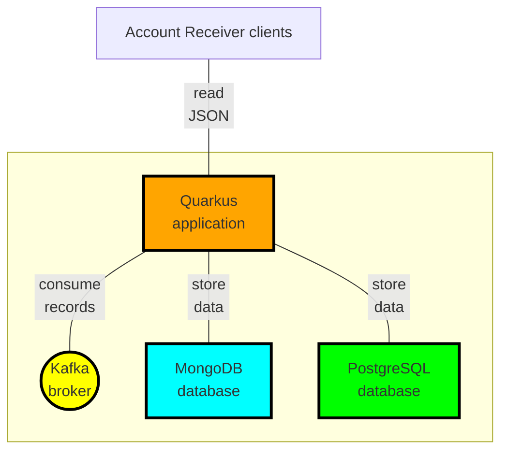
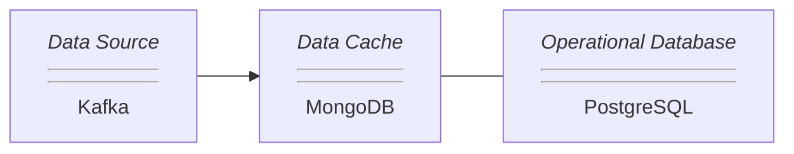
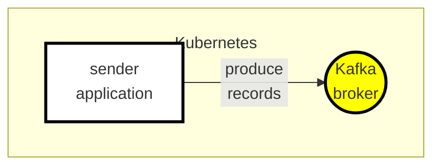

```mermaid
flowchart TB
CU["Account Receiver clients"]
subgraph " "
  QU["Quarkus<br>application"]:::orangeBox
  KA(("Kafka<br>broker")):::yellowBox
  MO["MongoDB<br>database"]:::cyanBox
  PO["PostgreSQL<br>database"]:::greenBox
end
CU --"&nbsp;read&nbsp;<br>&nbsp;JSON&nbsp;"--- QU
QU --"&nbsp;consume&nbsp;<br>&nbsp;records&nbsp;"--- KA
QU --"&nbsp;store&nbsp;<br>&nbsp;data&nbsp;"--- MO & PO

classDef greenBox   fill:#00ff00,stroke:#000,stroke-width:3px
classDef cyanBox    fill:#00ffff,stroke:#000,stroke-width:3px
classDef yellowBox  fill:#ffff00,stroke:#000,stroke-width:3px
classDef orangeBox  fill:#ffa500,stroke:#000,stroke-width:3px
```

```mermaid
flowchart LR
SRC[<i>Data Source</i><hr><hr>Kafka]
DC[<i>Data Cache</i><hr><hr>MongoDB]
ODB[<i>Operational Database</i><hr><hr>PostgreSQL]

SRC --> DC --- ODB
```

```mermaid
flowchart
subgraph "<br>Kubernetes"
  SE["sender<br>application"]:::whiteBox
  KA(("Kafka<br>broker")):::yellowBox
end
SE --"&nbsp;produce&nbsp;<br>&nbsp;records&nbsp;"--> KA

classDef yellowBox  fill:#ffff00,stroke:#000,stroke-width:3px
classDef whiteBox   fill:#ffffff,stroke:#000,stroke-width:3px
```