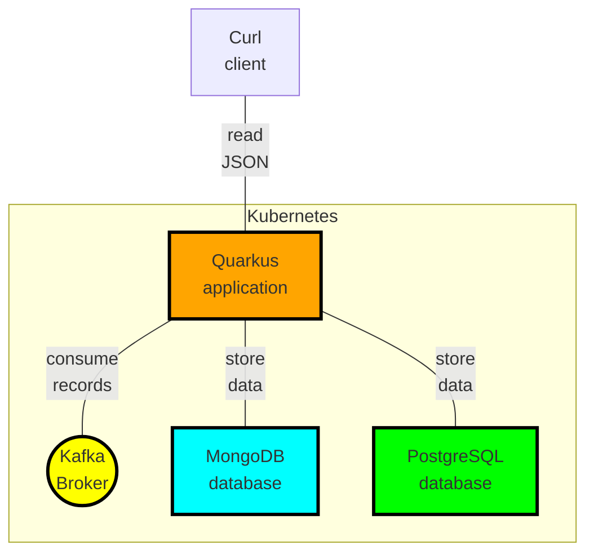
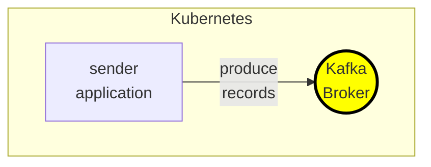

```mermaid
flowchart TB
CU["Curl
    client"]
subgraph "Kubernetes"
  QU["Quarkus
      application"]:::orangeBox
  KA(("Kafka
      Broker")):::yellowBox
  MO["MongoDB
      database"]:::cyanBox
  PO["PostgreSQL
      database"]:::greenBox
end
CU --"read
      JSON"--- QU
QU --"consume
      records"--- KA
QU --"store
      data"--- MO & PO

classDef greenBox   fill:#00ff00,stroke:#000,stroke-width:3px
classDef cyanBox    fill:#00ffff,stroke:#000,stroke-width:3px
classDef yellowBox  fill:#ffff00,stroke:#000,stroke-width:3px
classDef orangeBox  fill:#ffa500,stroke:#000,stroke-width:3px
```

```mermaid
flowchart
subgraph Kubernetes
  SE["sender
      application"]
  KA(("Kafka
      Broker")):::yellowBox
end
SE --"produce
      records"--> KA

classDef yellowBox  fill:#ffff00,stroke:#000,stroke-width:3px
```