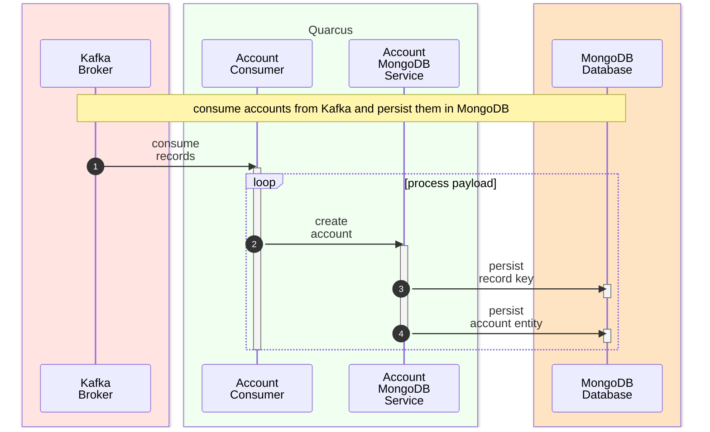
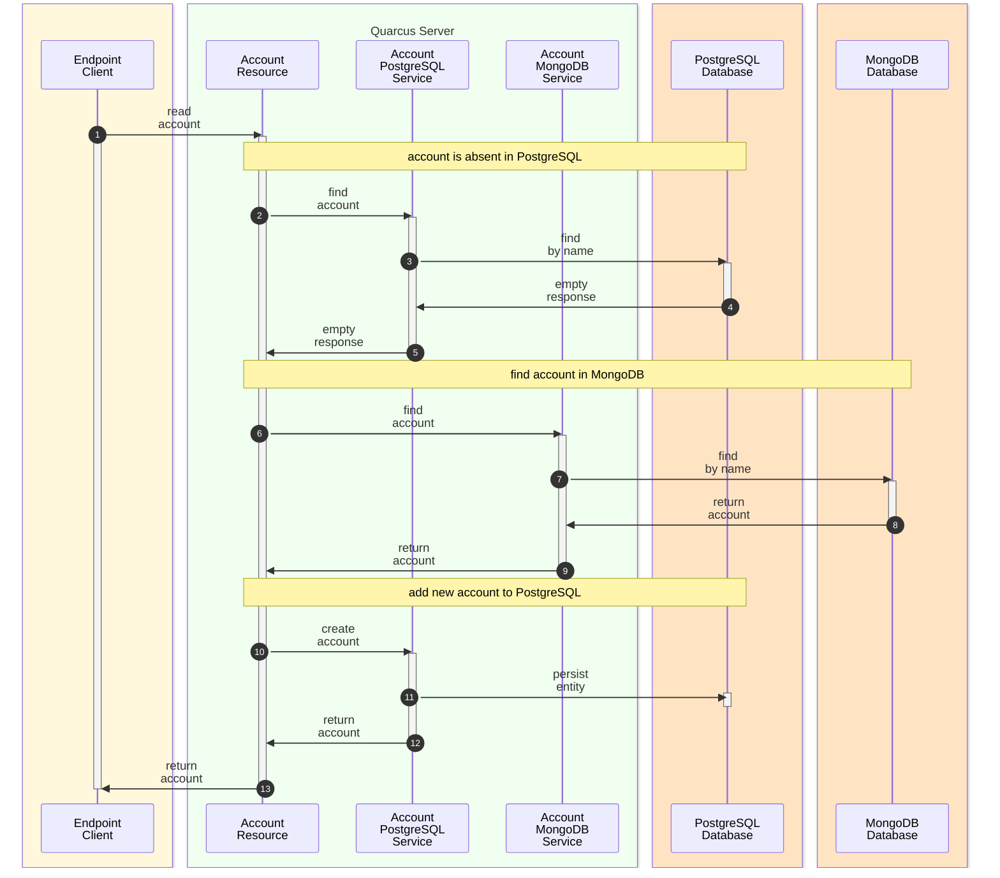
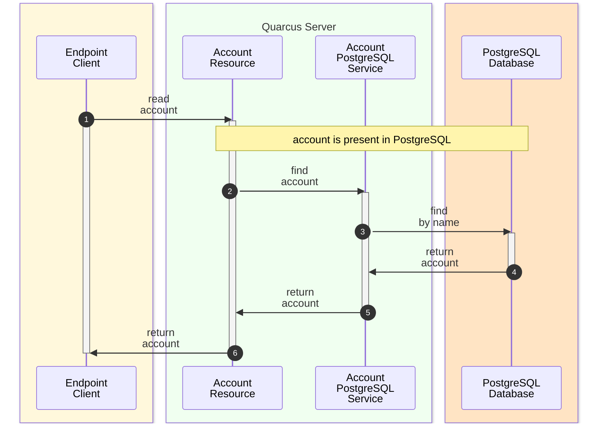

```mermaid
sequenceDiagram
autonumber
box mistyrose 
 participant KB as Kafka<br/>Broker
end
box honeydew <br/>Quarcus
 participant KC as Account<br>Consumer
 participant MS as Account<br>MongoDB<br>Service
end
box bisque
 participant MDB as MongoDB<br/>Database
end

Note over KB,MDB: consume accounts from Kafka and persist them in MongoDB
KB ->> KC: consume<br>records
activate KC
loop process payload
   KC ->> MS: create<br>account
   activate MS
   MS ->> MDB: persist<br>record key
   activate MDB
   deactivate MDB
   MS ->> MDB: persist<br>account entity
   activate MDB
   deactivate MDB
   deactivate MS
end
deactivate KC
```

```mermaid
sequenceDiagram
autonumber
box cornsilk
 participant EC as Endpoint<br/>Client
end
box honeydew <br/>Quarcus Server
 participant AR as Account<br/>Resource
 participant PS as Account<br/>PostgreSQL<br/>Service
 participant MS as Account<br/>MongoDB<br/>Service
end
box bisque <br/>
 participant PDB as PostgreSQL<br/>Database
end
box bisque <br/>
 participant MDB as MongoDB<br/>Database
end

EC ->> AR: read<br/>account
activate EC
activate AR
Note over AR,PDB: account is absent in PostgreSQL
AR ->> PS: find<br/>account
activate PS
PS ->> PDB: find<br/>by name
activate PDB
PDB ->> PS: empty<br/>response
deactivate PDB
PS ->> AR: empty<br/>response
deactivate PS

Note over AR,MDB: find account in MongoDB
AR ->> MS: find<br/>account
activate MS
MS ->> MDB: find<br/>by name
activate MDB
MDB ->> MS: return<br/>account
deactivate MDB
MS ->> AR: return<br/>account
deactivate MS

Note over AR,PDB: add new account to PostgreSQL
AR ->> PS: create<br/>account
activate PS
PS ->> PDB: persist<br/>entity
activate PDB
deactivate PDB
PS ->> AR: return<br/>account
deactivate PS
AR ->> EC: return<br/>account
deactivate AR
deactivate EC
```

```mermaid
sequenceDiagram
autonumber
box cornsilk 
 participant EC as Endpoint<br/>Client
end
box honeydew <br/>Quarcus Server
 participant AR as Account<br/>Resource
 participant PS as Account<br/>PostgreSQL<br/>Service
end
box bisque
 participant PDB as PostgreSQL<br/>Database
end

EC ->> AR: read<br/>account
activate EC
activate AR
Note over AR,PDB: account is present in PostgreSQL
AR ->> PS: find<br/>account
activate PS
PS ->> PDB: find<br/>by name
activate PDB
PDB ->> PS: return<br/>account
deactivate PDB
PS ->> AR: return<br/>account
deactivate PS
AR ->> EC: return<br/>account
deactivate AR
deactivate EC
```
